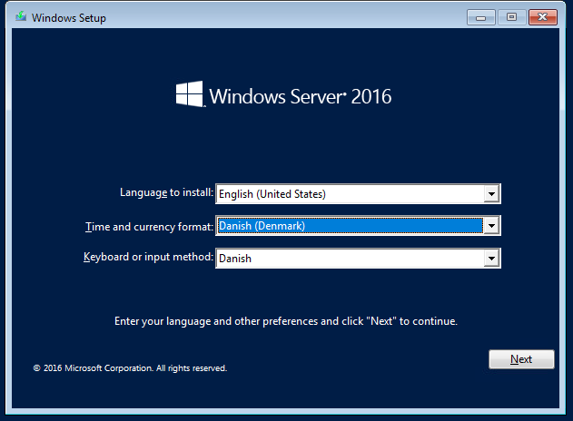
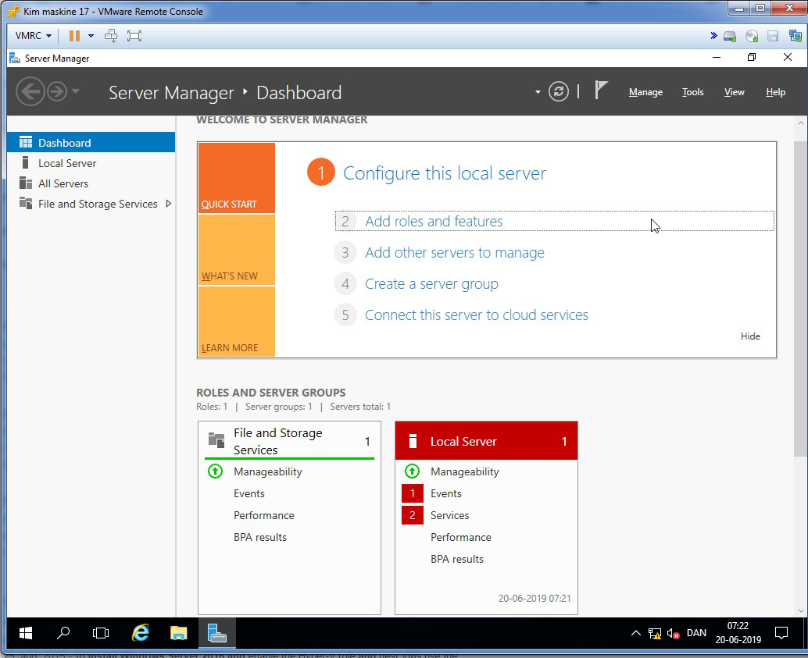

    

> **Installation af Windows 2016/2019 server i en Vmware client**

> indtast i en Chrome browser og klik på avanceret og Forsæt til
192.168.4.12

    

> Klik på "LAUNCH VSPHERE CLIENT (HTML 5)"

    

> Indtast dit bruger navn og password til elevnettet og derefter på login.

    

> I VMWARE vSphere Web Clienten kan den virtuelle maskine nu konfigureres og der kan installeres et gæste operativ system på den.

    

> Installation af gæste operativ system gøres på følgende måde:
> Start den virtuelle maskine ved at klikke på "Launch Remote Console":

    

> I det nye browser vindue er der en dialog box for aktivering af VMRC protokollen. Klik på "Open Vmware Remote Console

    

Der er nu et Vmware Remote Console vindue med en fejlbesked. Klik på "connect anyway".

    

Start den virtuelle maskine:

    

I console vinduet skal ISO filen med operativ systemet nu tilknyttes til et virtuelt Cdrom drev (højre klik på CD-ROM symbolet):

    

Vælg Windows server 2016/2019 ISO filen i stifinderen. Klik på "Open" Genstart den virtuelle maskine:

    

Umiddelbar efter genstarten klikkes der i vinduet med musen og derefter på Escape knappen.

    

Vælg 3. CD-rom Drive:

Installationen af Windows server starter op automatisk.

    

Vælg dansk "Time and currency format" og "Keyboard". Klik på "Next" og derefter "Install now". I Windows setup vælg "Windows server 2016/2019 Standard Evaluation" og derefter "Next".

    

Accepter licens betingelserne og derefter klik "Next"..

    

Klik på install:\
Mangler et sceen dump\
Installationen kører nu og status kan følges i nedenstående vindue:

    

Opret en administrator account. Klik "Finish".

    

Den virtuelle Windows 2016/2019 server er nu installeret:

    

Login på serveren. Klik på "VMRC" og derefter på "Send Ctrl+Alt+Del".

    

Log på som administrator.

    

Opsætning af netværk. Find "Network and Sharing Center".

    

Klik på "Change adapter settings". Dobbelt klik på "Ethernet0". I Dialogen "Ethernet0 Status" klik på "Properties".

    

Vælg "Internet Protocol Version 4" og derefter "Properties".

    

Indtast nedenstående informationer: OBS IP Address, Subnet mask og gateway får du af instruktøren.

    

Klik på "OK" for at afslutte netværkskonfigurationen.
